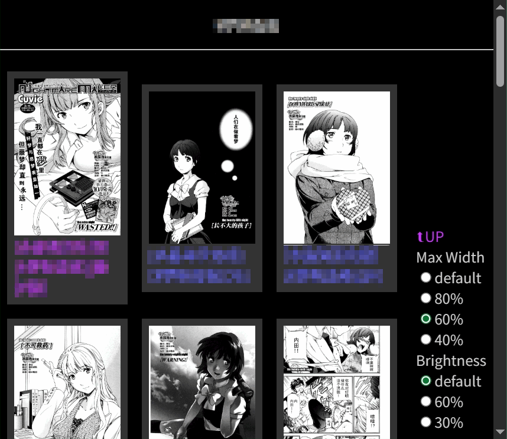

# View Comic Here 为你的漫画目录生成方便阅读的html文件

使用方法：

- 下载该软件以及 <https://github.com/shajunxing/sjx-script> 
- 把两个软件的 `bin` 目录添加到 `path` 环境变量
- 打开命令提示符，进入漫画目录，执行 `mch.bat` ，就会递归地在所有目录生成 `vch.html` ，双击打开即可愉快地阅读。

